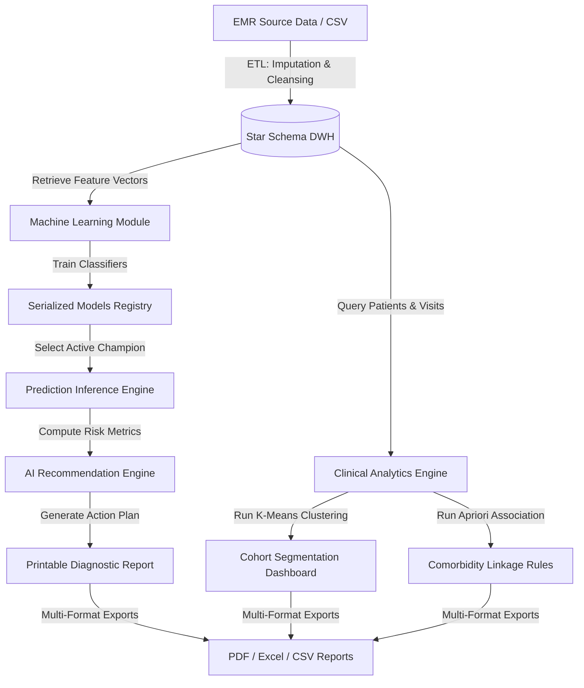

# AI-Driven Healthcare Decision Support System Using Data Warehousing and Predictive Data Mining Techniques

**An Academic DWDM & Machine Learning Capstone Project**

---

## 📋 Project Abstract

In modern healthcare, data is abundant but often siloed, preventing timely clinical insights. This project implements an **AI-Driven Healthcare Decision Support System (HDSS)** that integrates clinical data warehousing and advanced predictive data mining. By establishing a MySQL **Star Schema Data Warehouse** and an automated **ETL (Extract, Transform, Load) Pipeline**, patient data is centralized, cleaned (using median-based imputation), and prepared for analysis. 

The system implements three distinct branches of data mining:
1. **Predictive Modeling (Supervised Classification)**: Custom implementations of Random Forest, Logistic Regression, and Decision Tree classifiers predict patient-specific diabetes risk.
2. **Patient Cohort Segmentation (Unsupervised Clustering)**: An optimized K-Means algorithm groups patients into distinct risk clusters.
3. **Comorbidity Discovery (Association Rule Mining)**: An Apriori-style algorithm discovers relationships between clinical parameters (e.g., `Obesity ➔ Diabetes`).

The clinical dashboard, reports engine, and recommendation checklist provide actionable decision support to improve patient outcomes.

---

## 🛠️ Technology Stack

- **Frontend & Routing**: Next.js 16 (App Router), React 19, TypeScript
- **State & UI Layout**: Pure Vanilla CSS, CSS Variables Design System (Lucide React Icons)
- **Database & Data Warehouse**: MySQL (Star Schema), Local JSON Fallback DB (Node File System)
- **Mathematical Classifiers & Mining**: Native TypeScript implementations of Random Forest, Logistic Regression, Decision Tree, K-Means Clustering, and Apriori Association Rules

---

## 🗺️ System Architecture



---

## 🗂️ Core Project Modules

- **Patient Registry**: Complete CRUD interface managing patient cards, demographics, and cascade history deletions.
- **ETL Synchronization**: CSV uploader and cleanser that handles missing data using median-based imputation and populates DWH dimension and fact tables.
- **DWH Explorer**: Relational Star Schema visualizer detailing table records, foreign keys, and indexes.
- **ML Workspace**: Pipeline for training, evaluating, and serializing Random Forest, Logistic Regression, and Decision Tree models.
- **Disease Prediction Wizard**: 8-feature diagnostic wizard rendering circular gauges for prediction confidence and patient risk score.
- **AI Recommendation Engine**: Actionable clinical checklists that compile into printable patient diagnostic records.
- **Mining Analytics**: Heatmaps, tables, and charts presenting K-Means clustering cohorts and Apriori comorbidity rules.
- **Executive Dashboard**: Polling dashboard with 4 KPI cards and 5 interactive SVG charts (donut, line, bar) that auto-refreshes every 15 seconds.
- **Multi-Format Reports**: Export system allowing CSV, Excel, and PDF downloads from both a dedicated report center and the main dashboard.

---

## 📚 Technical Documentation

To explore specific modules of this Capstone project, refer to the following documentation files under the [docs/](file:///c:/Users/vaish/OneDrive/Documents/projects/Health%20care/docs/) folder:

1. 🗄️ **[Database & Star Schema Documentation](file:///c:/Users/vaish/OneDrive/Documents/projects/Health%20care/docs/schema_documentation.md)**: Details the star schema structure, dimension tables (`dim_patient`, `dim_doctor`, `dim_disease`, `dim_time`), fact table (`fact_patient_visit`), indices, and integrity cascade deletions.
2. ⚙️ **[Installation & Deployment Guide](file:///c:/Users/vaish/OneDrive/Documents/projects/Health%20care/docs/installation_and_deployment.md)**: Step-by-step instructions for local fallback setup, MySQL database migrations, environment configurations, and production build pipelines.
3. 🧠 **[Predictive Data Mining & ML Math Sheets](file:///c:/Users/vaish/OneDrive/Documents/projects/Health%20care/docs/data_mining_and_ml.md)**: Deep dive into the formulas and implementation logic behind supervised classification, K-Means clustering normalization, Apriori association metrics (support, confidence, lift), and median-based data cleansing.
4. 🔌 **[Next.js API Routes Catalog](file:///c:/Users/vaish/OneDrive/Documents/projects/Health%20care/docs/api_documentation.md)**: Lists all backend API routes, query schemas, and request/response structures.

---

## 🚀 Quick Start (Local Development)

### 1. Prerequisites
Install [Node.js v18+](https://nodejs.org/) on your local machine.

### 2. Configure Environment
Copy `.env.example` or create a `.env` in the root directory:
```env
MYSQL_HOST=localhost
MYSQL_PORT=3306
MYSQL_USER=your_mysql_username
MYSQL_PASSWORD=your_mysql_password
MYSQL_DATABASE=healthcare_dwh
```
*(If MySQL environment variables are omitted, the application automatically falls back to the local database file `data/db.json` with pre-seeded data).*

### 3. Setup Project
Run the following commands in your terminal:
```powershell
npm install
npm run dev
```
Open [http://localhost:3000](http://localhost:3000) in your browser. Log in using the default administrative credentials:
- **Email**: `admin@healthcare.com`
- **Password**: `admin123`
